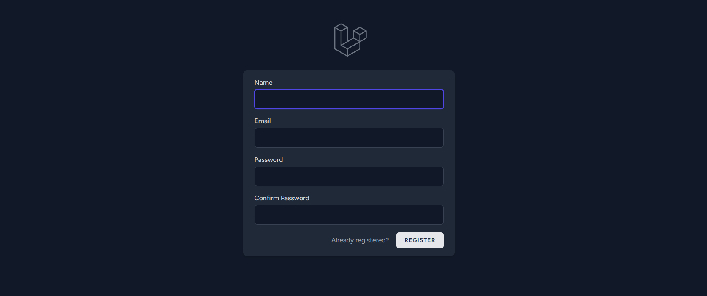

# ETS-PBKK

| NRP | Name |
| --- | --- |
| 5025211015 | Muhammad Daffa Ashdaqfillah |

## Problem

Sebuah rumah sakit memerlukan sistem pencatatan rekam medis pasien dengan ketentuan sbb:

1. (5%) Buat project Laravel baru
2. (5%) Pengguna harus login agar dapat mengakses riwayat rekam medis pasien
3. (30%) Ada halaman melihat semua rekam medis, riwayat rekam medis per pasien, dan halaman rekam medis per dokter
4. (35%) Tersedia formulir rekam medis dengan field:
    - dropdown pasien (ambil dari database),
    - dropdown dokter (ambil dari database),
    - field kondisi kesehatan (teks),
    - suhu tubuh (35 C - 45.5 C)
    - mengunggah file/gambar resep (pdf/png/jpg/jpeg)
    - Form rekam medis tidak wajib disimpan di database (nilai +10% jika bisa menyimpan di DB)
    - Sistem dapat memberikan flash message **berhasil** jika form berhasil diinputkan sesuai ketentuan (meskipun tidak tersimpan di DB).
5. (15%) Siapkan data pasien dan dokter di seeder (manual), sedangkan rekam medis di factories (generate dengan faker)

Ketentuan ETS:

- Individu
- Open Reference namun tidak boleh bertanya di forum/ orang lain
- Durasi 2.5 jam (13.00-15.30)
- Kirim Screenshot hasil (per halaman) (zip) dan link github (public)

## Hasil Pengerjaan

### Halaman

1. Halaman Awal (mengarahkan ke login dan register)
    
    
    
2. Halaman Login dan Register 
    
    
    
    
    
3. Halaman Dashboard
    
    
    
4. Halaman Rekam Medis List
    
    
    
5. Halaman Rekam Medis Pasien
    
    
    
6. Halaman Rekam Medis Dokter
    
    
    
7. Halaman Tambah Rekam Medis
    
    
    
8. Halaman Edit Rekam Medis
    
    